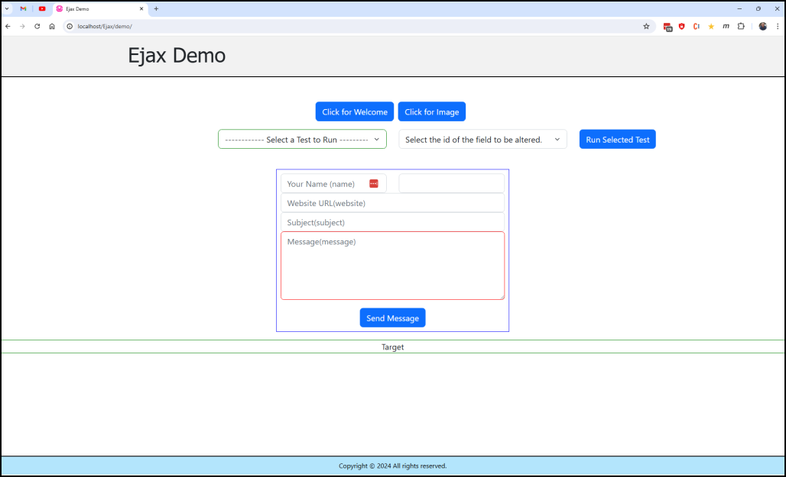
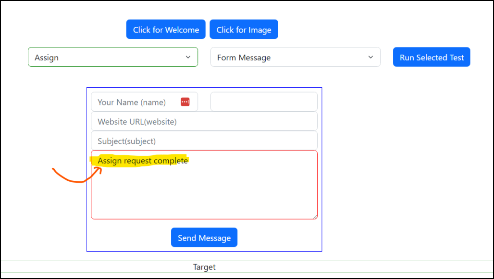

#### Using the Ejax Demo 

1. Navigate to localhost/Ejax/demo.
2. The following screen should appear:  
 

3. Click on "Click for Welcome"  to display a message in the target div.
4. Click on "Click for Image" to display an image in the target div.
5. Fill out the form and click "Send Message" and the form fields will show up in target div.
6. The dropdowns contain a list  actions to run and a list of the screen fields to put the result in. Select a test and a field and click "RunSelectedTest". The result should appear in the field. Here's an example of assigning to the form message textbox:

